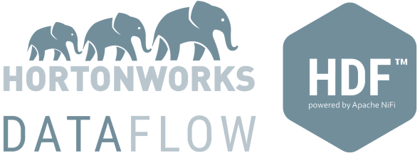

# HDF
-  

[Docker](https://www.docker.com/what-docker) image for [Hortonworks DataFlow](http://hortonworks.com/products/data-center/hdf/).

Created from HDF [base image](https://hub.docker.com/r/xemuliam/hdf-base) to minimize traffic and deployment time in case of changes should be applied on top of HDF

                        ##         .
                  ## ## ##        ==
               ## ## ## ## ##    ===
           /"""""""""""""""""\___/ ===
      ~~~ {~~ ~~~~ ~~~ ~~~~ ~~~ ~ /  ===- ~~~
           \______ o   HDF     __/
             \    \   2.0.1 __/
              \____\_______/

Please bear in mind that HDF is powered by Apache NiFi.
Thus all NiFi-related information is applicable to HDF.

Please go to my [NiFi repository](https://hub.docker.com/r/xemuliam/nifi/) to read some useful/important things.

# Enjoy! :)
